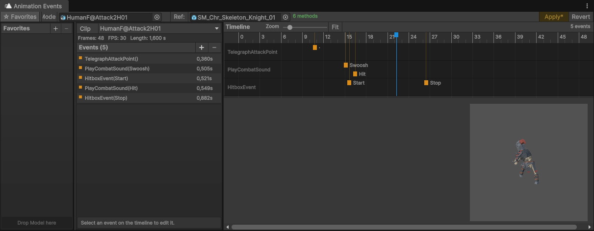

<h1 align="center">
 


 Unity Animation Event Editor
</h1>

<p align="center">
 A simple editor extension to edit animation events in a more user-friendly way.
</p>

<p align="center"> • 
  <a href="#about">About</a> •
  <a href="#installation">Installation</a> •
  <a href="#other">Other</a> •
</p>

# About

This Editor Window modifies the Animation Events directly on the import settings. This has the benefit that re-importing animations keeps the events intact and creating copies for animations is not needed.

Unity's builtin animation panel would show these animatios in a "(Read-Only)" state.

## Limitations

- Only works with FBX right now

## Features

- Project shared Favorites Panel, to quickly jump between files
- Supports multiple Clips per Model
- Add a `Prefab` of your game object into the "Ref:" field, to show a preview of your mesh + nice function selector
- creates a visually distinct line per function and groupes them based on that. Also automatically tries to reduce overlap by using a second line if parameter names are too close.

# Installation

using Unity Package Manager:

add a package to

```
https://github.com/soraphis/UnityStateTree.git
```

# Other

This project was created with heavy AI assistance.

## Inspirations
- https://assetstore.unity.com/packages/tools/animation/better-animation-events-329232
  - This asset is a great inspiration for this project. But it does not add the events to the Import Settings but promotes copy-based workflows.
- https://www.fab.com/listings/14d8cc38-e39f-494e-9e33-bfc37094b10c
  - Looked pretty unfinished and not ergonomic.

## License

The LPGP v3.0 requires derived work to remain open source while still allowing usage in closed source projects.
Since this is Editor Only code, nothing of it will ship with the final game.